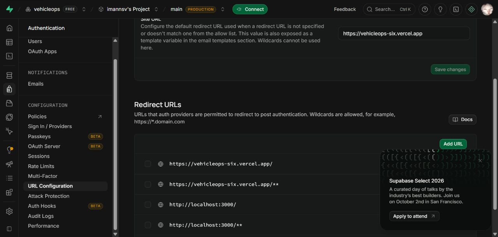

# GitHub und Vercel

Das Arbeitsrepository ist [imannsv/vehicleops](https://github.com/imannsv/vehicleops). Die App liegt direkt im Repository-Hauptverzeichnis.

Produktionsadresse: **[vehicleops-six.vercel.app](https://vehicleops-six.vercel.app)**. Vercel-Projekt: [Dashboard](https://vercel.com/imanabi/vehicleops).

## Änderungen veröffentlichen

Für Änderungen einen Branch anlegen und einen Pull Request nach `main` öffnen. GitHub Actions prüft Lint, Fachlogik, Typen, Produktionsbuild und die Browserabläufe auf Desktop und Mobilgeräten. Vercel erzeugt für Branches eine Preview und veröffentlicht `main` als Produktion. Ein direkter Push nach `main` ist ebenfalls möglich und startet dieselben Prüfungen.

Die GitHub-Prüfungen sperren Deployments nicht automatisch. Branch-Schutz ist derzeit nicht eingerichtet. Vor einem Merge fehlgeschlagene Prüfungen beheben und die Preview prüfen.

## Vercel-Konfiguration

- Team: `imanabi`, Projekt: `vehicleops`
- Framework: Next.js
- Root Directory: Repository-Hauptverzeichnis
- Node.js: 24.x
- Installation: `npm ci`
- Build: `npm run build`
- Produktionsbranch: `main`

Die beiden Variablen aus `.env.example` werden in Vercel für Production, Preview und Development gepflegt. Sie werden beim Build eingebunden. Nach einer Änderung neu deployen. Ausschließlich Supabase-URL und Publishable Key verwenden; Service-Role-Schlüssel gehören nicht in die Web-App. `.env.local`, `.vercel`, Builddateien und lokale Supabase-Testdaten bleiben außerhalb von Git.

Previews sind mit der bestehenden Supabase-Datenbank verbunden. Angemeldete Personen bearbeiten dort dieselben Organisationsdaten wie in der Produktion. Tests, die Fixtures schreiben, laufen ausschließlich gegen den lokalen Supabase-Stack.

## Live-Prüfung

```powershell
$env:VEHICLEOPS_BASE_URL='https://vehicleops-six.vercel.app'
node tests/cloud.smoke.mjs
```

Die Prüfung liest die lokale Cloud-Konfiguration, überprüft Anmeldung und Registrierung, die geschützte VIN-Route und die Sperre anonymer Datenzugriffe. Sie legt keine Benutzer oder Fahrzeuge an. Ohne `VEHICLEOPS_BASE_URL` wird localhost geprüft.

Supabase Authentication verwendet `https://vehicleops-six.vercel.app` als Site URL. Erlaubte Redirects sind die Produktionsadresse und `http://localhost:3000`, jeweils mit `/` und `/**`, damit auch Einladungsparameter funktionieren. Diese Einstellungen wurden im Dashboard gespeichert und geprüft. Neue Preview-Adressen nur bei Bedarf als erlaubte Auth-Redirects ergänzen.



## Datenbankänderungen und Wiederherstellung

Neue SQL-Migrationen gehören nach `supabase/migrations`. Git-Pushes wenden sie nicht automatisch auf Supabase an. Schemaänderungen getrennt prüfen und vor einem davon abhängigen App-Deployment anwenden. Angewendete Migrationen nicht nachträglich ändern.

Bei einem fehlerhaften App-Deployment kann im Vercel-Dashboard ein vorheriger erfolgreicher Stand wieder zur Produktion werden. Danach die Ursache per Commit beheben. Datenbankmigrationen werden durch einen App-Rollback nicht zurückgenommen.

## Unternehmensprofil und Protokolle – 2. Oktober 2026

Nach lokaler Prüfung mit leerem Schema und Altbeständen sind drei weitere additive Migrationen im ausgewählten Projekt `nfocyuyuloyjaikkflai` angewendet:

| Lokale Migration | Cloud-Version | Name |
|---|---|---|
| `20261002131221_company_vehicle_identity.sql` | `20261002142132` | `company_vehicle_identity` |
| `20261002131827_structured_protocols.sql` | `20261002142140` | `structured_protocols` |
| `20261002133356_vehicle_image_covers.sql` | `20261002142143` | `vehicle_image_covers` |

Die Cloud-Verwaltung vergibt eigene Zeitstempel. Für diese bereits angewendeten Dateien keine zweite Migration über einen ungeprüften CLI-Push erzeugen. Der lokale isolierte Stack führt dieselben Inhalte unter den lokalen Dateiversionen. Insgesamt sind zwölf Migrationen angewendet.

Alte Speicher- und Abschlussaufrufe bleiben kompatibel. Neue Protokolle verwenden die neue atomare Abschlussfunktion mit optionalem Auftrag und eingefrorenen Firmen-/Fahrzeugdaten. Alte Protokolle behalten ihren bisherigen PDF-Export. `company-logos` ist privat, Logoversionen werden nicht überschrieben; Bildvorschauen werden serverseitig auf Organisationszugriff geprüft. Es sind keine neuen Umgebungsvariablen erforderlich.

GitHub Actions prüft nun 51 Fachlogiktests und 40 Desktop-/Mobilprüfungen. Schreibende Datenbank- und Cloud-Browserprüfungen werden zusätzlich gegen den lokalen Supabase-Stack ausgeführt; die öffentliche Smoke-Prüfung legt keine Geschäftsdaten an. Details: [VALIDATION.md](VALIDATION.md).
# Fahrzeugakte und Recovery – 2. Oktober 2026

Die Erweiterung verwendet zwei additive Migrationen: Fahrzeugakte/Anhänge/Schlüssel und einen ergänzenden Halter-Fremdschlüsselindex. Sie werden vor der App im gewählten Supabase-Projekt angewendet. Die alte Abschluss-API und frühere Fahrzeugbearbeitungsaufrufe bleiben kompatibel; neue App-Abschlüsse verwenden `finalize_handover_v2`. Halterdaten und Dokumente werden nicht in Protokollkopien übernommen.

Die App enthält `/auth/reset-password`; die bestehende Produktionsfreigabe `https://vehicleops-six.vercel.app/**` umfasst diesen Pfad. Ein eigener produktiver SMTP-Anbieter und die Absender-Domain stehen aus. Lokale Recovery- und Uploadprüfungen sind in [VALIDATION.md](VALIDATION.md), Einrichtung in [VEHICLE_RECORDS.md](VEHICLE_RECORDS.md) dokumentiert.

## Bestandsverwaltung – 2. Oktober 2026

Die additive neunte Migration `fleet_inventory` ist vor dem App-Deployment im ausgewählten Supabase-Projekt angewendet. Sie ergänzt Standorte, Stellplätze und unveränderliche Bewegungen, ohne bestehende Freitextstandorte zuzuordnen oder alte Protokolle umzuschreiben. Beide Abschluss-APIs geben den Stellplatz bei Übernahme atomar frei. GitHub Actions prüft 39 Fachlogiktests und 30 Desktop-/Mobilprüfungen. Bedienung: [INVENTORY.md](INVENTORY.md).
