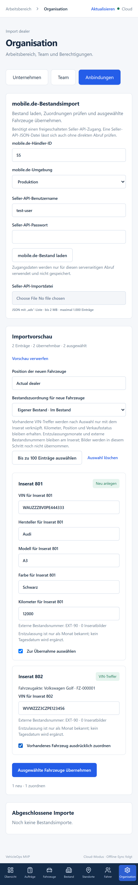

# mobile.de: erster Bestandsimport

Unter **Organisation → Anbindungen** können Administratoren und Disposition den mobile.de-Bestand prüfen und ausgewählte Fahrzeuge übernehmen. Zuschauer und Fahrer erhalten keinen Zugang zu Importen oder Inseratzuordnungen.

## Bestand laden und prüfen

1. Die numerische Händler-ID (`mobileSellerId`) und Produktion oder Sandbox auswählen.
2. Mit freigeschaltetem Seller-API-Zugang den Bestand abrufen. Benutzername und Passwort werden ausschließlich für diesen Abruf verwendet; das Passwort wird sofort aus dem Formular gelöscht. Zugangsdaten werden weder in der Datenbank noch im lokalen Speicher abgelegt.
3. Alternativ eine Seller-API-JSON-Datei mit einer `ads`-Liste auswählen: höchstens 2 MB und 1.000 Einträge. Die Vorschau zeigt jeweils 25 Einträge. Dies ist kein allgemeiner CSV-Import.
4. Fehlende VIN, Hersteller, Modell, Farbe oder Kilometer ergänzen. Fehlende Kilometer werden nicht als null Kilometer ausgegeben. Abweichende Händler-IDs, andere Fahrzeugklassen als PKW, doppelte Inserat-IDs und doppelte VINs sperren die betroffenen Einträge.
5. Für neue Fahrzeuge die tatsächliche Position und Bestandszuordnung bestätigen. „Noch nicht zugeordnet“ ist voreingestellt. Eigener Bestand startet ausdrücklich mit „Im Bestand“; der Veröffentlichungszustand des Inserats bestimmt keinen Verkaufsstatus.
6. Einträge einzeln auswählen oder bis zu 100 übernehmbare Einträge markieren. Erst „Ausgewählte Fahrzeuge übernehmen“ speichert den Import.

Ein organisationsinterner VIN-Treffer bietet die ausdrückliche Verknüpfung mit der bestehenden Fahrzeugakte an. Dabei bleiben alle Fahrzeugdaten einschließlich Kilometer, Position und Verkaufsstatus unverändert. Bereits zugeordnete Inserate können nicht nochmals übernommen werden. Bei einer zwischenzeitlichen Fahrzeugänderung scheitert der gesamte Import; „Aktualisieren“ lädt den aktuellen Stand für eine neue Prüfung.

Neue Fahrzeuge erhalten ihre eigene interne ID, automatisch eine interne Bestandsnummer und kein erfundenes Zulassungskennzeichen. Explizites Baujahr wird übernommen; Modelljahr wird nicht als Baujahr verwendet. Ein Erstzulassungsmonat aus der API bleibt als Monat am Inserat gespeichert: Ein unbekannter Tag wird nicht ergänzt. Die vollständige Erstzulassung kann später in der Fahrzeugakte angegeben werden. Externe Bestandsnummern ersetzen keine internen Bestandsnummern.

## Daten und Wiederholung

`external_listings` führt Organisation, internes Fahrzeug, Plattform, Umgebung, Händler-ID und externe Inserat-ID getrennt. `platform_import_runs` speichert abgeschlossene Läufe, Person, Zeitpunkt, Anzahl neuer Fahrzeuge und Anzahl ausdrücklicher Zuordnungen. Inseratmetadaten enthalten nur Erstzulassungsmonat, externe Bestandsnummer und Bildanzahl; Rohantworten, Beschreibungen, Kontaktdaten und Zugangsdaten werden nicht gespeichert.

Die Abschlussfunktion prüft Mitgliedschaft, Revisionen und VINs und speichert den gesamten ausgewählten Stapel in einer Transaktion. Ein Fehler verwirft auch zuvor angelegte Fahrzeuge und Bewegungen dieses Stapels. Gleichzeitige Wiederholungen derselben Import-ID mit identischen Angaben liefern dasselbe Ergebnis. Änderungen unter derselben ID werden abgewiesen. Nach einem unklaren Netzwerkfehler bleibt die Import-ID im geöffneten Formular für den Wiederholungsversuch erhalten. Nach einem Neuladen werden vorhandene VINs und Inseratzuordnungen erneut geprüft.

Die Historie zeigt die letzten 20 erfolgreichen Läufe. Produktion und Sandbox haben getrennte Inseratzuordnungen; die gewählte Sandbox kann trotzdem nach ausdrücklicher Bestätigung Fahrzeuge im aktuellen VehicleOps-Arbeitsbereich anlegen.

## API-Zugang und Grenzen

Der Adapter verwendet ausschließlich den lesenden Seller-API-Aufruf `GET /seller-api/sellers/{mobileSellerId}/ads` mit Basic Auth und dem JSON-Accept-Header. Ziele sind fest auf die offiziellen HTTPS-Dienste begrenzt, Weiterleitungen sind gesperrt. Der Abruf hat ein 20-Sekunden-Zeitlimit und ein 2-MB-Antwortlimit. Quelle und Zugangsvoraussetzungen: [offizielle mobile.de-Seller-API](https://services.mobile.de/docs/seller-api.html), geprüft am 2. Oktober 2026.

Für einen echten Abruf benötigt der Händler einen durch mobile.de freigeschalteten Seller-API-Zugang. Diese Freischaltung und ein Test mit einem tatsächlichen Händlerbestand stehen aus. Keine Zugangsdaten in Chats oder Git-Dateien eintragen; hierfür das geschützte Formular in der angemeldeten App verwenden. Es sind keine zusätzlichen Vercel-Umgebungsvariablen erforderlich.

Diese erste Iteration importiert Fahrzeuggrunddaten. Inseratbilder werden gezählt, aber noch nicht in die Fahrzeuggalerie übernommen. Preise, vollständige Beschreibungen, komplette Ausstattung und Veröffentlichungsstatus werden ebenfalls noch nicht importiert. Es gibt keine automatischen Abrufe, gespeicherten Händlerzugänge, Aktualisierung vorhandener Fahrzeugdaten, Löschung verschwundener Inserate oder Veröffentlichung von Inseraten. Größere Bestände benötigen später einen Import mit Warteschlange und erweiterten Grenzen.

Als Nächstes folgen der echte Sandbox-/Händlertest und ein separater Bildimport mit nachvollziehbarer Herkunft. Inseratveröffentlichung und regelmäßige Synchronisation folgen anschließend mit ausdrücklicher Vorschau und Freigabe.

